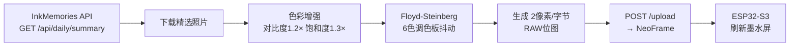

# NeoFrame 电子相框推送

将 InkMemories 每日精选照片推送至 ESP32-S3 墨水屏相框。

## 概述

`push_to_ink.py` 是一个独立脚本，从 InkMemories API 拉取今日精选照片，经过 e-ink 色彩转换后，通过 HTTP POST 上传至 NeoFrame 墨水屏显示。

## 色彩转换

### 6 色调色板

原始照片（24-bit RGB）被映射到 6 色 e-ink 调色板：

| 颜色 | RGB 值 |
|------|--------|
| 白色 | `#FFFFFF` |
| 黑色 | `#000000` |
| 红色 | `#FF0000` |
| 黄色 | `#FFFF00` |
| 蓝色 | `#0000FF` |
| 绿色 | `#00FF00` |

### 色彩增强

在 Floyd-Steinberg 抖动前进行色彩预处理：

- **对比度 1.2×** — `(pixel-128)×1.2+128`，扩大亮暗差距
- **饱和度 1.3×** — 像素与灰度值的差距放大 30%，让 6 色区分更明显

### Floyd-Steinberg 抖动

标准 F-S 抖动算法，误差扩散矩阵：

```
    X  7/16
 3/16 5/16 1/16
```

最近邻颜色匹配使用 **CIE Lab 色彩空间** 计算感知色差，确保颜色映射符合人眼感受。

## 推送流程



## 配置

脚本自动读取 InkMemories 的 `.env` 文件，也可以在环境中直接设置：

| 环境变量 | 说明 | 默认值 |
|----------|------|--------|
| `NEOFRAME_HOST` | NeoFrame IP 地址 | `192.168.1.248` |
| `NAS_USER` | NAS SMB 用户名 | `username` |
| `NAS_PASS` | NAS SMB 密码 | (空) |
| `NAS_HOST` | NAS IP 地址 | `192.168.1.244` |
| `NAS_SHARE` | SMB 共享名 | `homes` |
| `INKMEMORIES_URL` | InkMemories 首页 URL | `http://localhost:8765` |

也可直接在 `push_to_ink.py` 顶部修改默认值。

## 使用方法

```bash
# 手动推送
python push_to_ink.py

# 定时任务（每天凌晨自动推送）
# 添加到群晖「任务计划」或 crontab：
# 0 3 * * * cd /path/to/ink-memories && python push_to_ink.py
```

## 错误处理

- **API 不可达**：静默退出，不阻塞
- **无今日精选照片**：输出日志后退出
- **NeoFrame 连接失败**：重试 3 次，间隔 5 秒
- **图片加载失败**：跳过该张，继续处理其余
